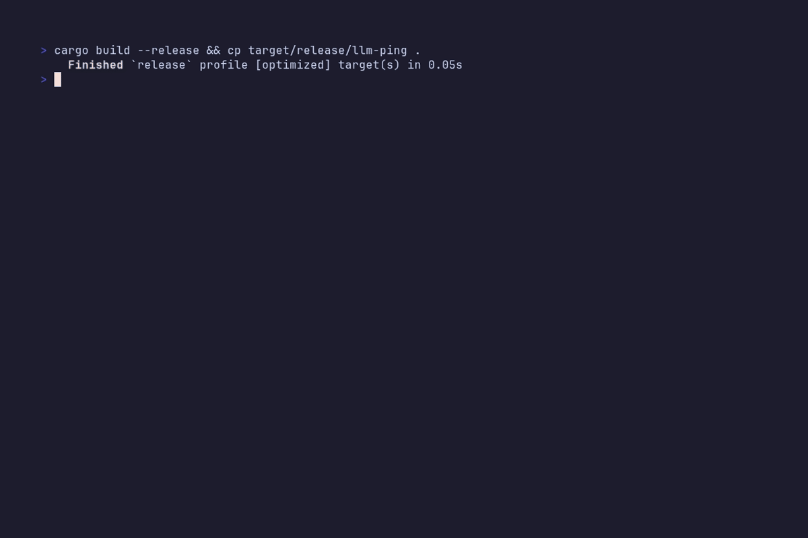

# llm-ping

Detailed latency diagnostic for LLM API endpoints. Measures each phase of a request (DNS, TCP, TLS, HTTP first byte, time-to-first-token (TTFT), generation throughput, and end-to-end total) decomposed per request.



## Install

```bash
cargo install --git https://github.com/TeddyHuang-00/llm-ping
# or from source:
cargo build --release
```

## Quick Start

Test a local Ollama instance:

```bash
llm-ping --provider ollama
```

Test a remote provider with multiple requests:

```bash
llm-ping --provider openai -c 5 --warm 1
```

## Timing Phases

Each request is broken into the following phases, reported as columns in the results table:

| Phase | Description |
|-------|-------------|
| **DNS** | DNS resolution — how long to resolve the hostname |
| **TCP** | TCP connection establishment latency |
| **TLS** | TLS handshake duration (omitted for plain HTTP) |
| **HTTP FB** | HTTP first byte — time from sending the request to receiving the first response byte |
| **TTFT** | Time to first token — latency from request send to first content token in the stream |
| **Gen** | Generation time — duration from first token to stream completion |
| **tok/s** | Token throughput during the generation phase only |
| **Total** | Wall-clock end-to-end time for the entire request |

When `-c N` with `N > 1`, an **Avg** row is appended with per-phase averages and aggregate token throughput.

## Providers

30+ built-in providers with sensible defaults:

| Provider | Flag | Default Model |
|----------|------|--------------|
| Ollama | `ollama` | gemma4:12b |
| OpenAI | `open-ai` | gpt-4o |
| Anthropic | `anthropic` | claude-sonnet-4-20250514 |
| DeepSeek | `deep-seek` | deepseek-v4-flash |
| OpenRouter | `open-router` | auto |
| Gemini | `gemini` | gemini-2.0-flash |
| GLM / Zhipu | `glm` / `zhipu` | glm-4-plus |
| Z.AI | `zai` | glm-4-plus |
| Kimi / Moonshot | `kimi` | kimi-k2.7-code |
| SiliconFlow | `siliconflow` | moonshotai/Kimi-K2.6 |
| Alibaba (DashScope) | `alibaba` | qwen3-coder-plus |
| MiniMax | `minimax` | MiniMax-M2.1 |
| Groq | `groq` | llama-3.3-70b-versatile |
| Together | `together` | meta-llama/Llama-3.3-70B-Instruct |
| DeepInfra | `deepinfra` | meta-llama/Llama-3.3-70B-Instruct |
| Fireworks | `fireworks-ai` | llama-v3p3-70b-instruct |
| StepFun | `stepfun` | step-1-32k |
| xAI (Grok) | `xai` | grok-4 |
| Perplexity | `perplexity` | sonar-pro |
| Mistral | `mistral` | codestral-latest |
| Cohere | `cohere` | command-a |
| Cerebras | `cerebras` | llama3.1-8b |
| Nebius | `nebius` | Meta-Llama-3.3-70B-Instruct |
| Novita | `novita-ai` | llama-3.1-8b-instruct |
| Friendli | `friendli` | gemma-4-31B-it |
| NVIDIA | `nvidia` | llama-3.3-70b-instruct |
| SambaNova | `sambanova` | Meta-Llama-3.3-70B-Instruct |
| OpenAI-compatible | `openai-compatible` | custom |
| Anthropic-compatible | `anthropic-compatible` | custom |

> `openai-compatible` and `anthropic-compatible` are generic — they require `--url` and `--model`.

### API Key Detection

API keys are auto-detected from the environment. Per-provider env vars:

| Provider | Env Var(s) |
|----------|-----------|
| OpenAI | `OPENAI_API_KEY` |
| Anthropic | `ANTHROPIC_API_KEY`, `ANTHROPIC_TOKEN` |
| DeepSeek | `DEEPSEEK_API_KEY` |
| OpenRouter | `OPENROUTER_API_KEY` |
| Gemini | `GEMINI_API_KEY`, `GOOGLE_API_KEY` |
| GLM / Zhipu | `ZHIPUAI_API_KEY`, `GLM_API_KEY` |
| Z.AI | `GLM_API_KEY`, `ZAI_API_KEY`, `Z_AI_API_KEY` |
| Kimi / Moonshot | `MOONSHOT_API_KEY`, `KIMI_API_KEY` |
| SiliconFlow | `SILICONFLOW_API_KEY` |
| Alibaba | `ALIBABA_API_KEY`, `DASHSCOPE_API_KEY` |
| MiniMax | `MINIMAX_API_KEY` |
| Groq | `GROQ_API_KEY` |
| Together | `TOGETHER_API_KEY` |
| DeepInfra | `DEEPINFRA_API_KEY` |
| Fireworks | `FIREWORKS_API_KEY` |
| StepFun | `STEPFUN_API_KEY` |
| xAI | `XAI_API_KEY` |
| Perplexity | `PERPLEXITY_API_KEY` |
| Mistral | `MISTRAL_API_KEY` |
| Cohere | `COHERE_API_KEY` |
| Cerebras | `CEREBRAS_API_KEY` |
| Nebius | `NEBIUS_API_KEY` |
| Novita | `NOVITA_API_KEY` |
| Friendli | `FRIENDLI_API_KEY` |
| NVIDIA | `NVIDIA_API_KEY` |
| SambaNova | `SAMBA_API_KEY`, `SAMBANOVA_API_KEY` |
| OpenAI-compatible | `CUSTOM_API_KEY` |

Override with `-k` / `--api-key`.

## Advanced Usage

```bash
# Multiple requests with warmup
llm-ping --provider deep-seek -c 10 --warm 2

# Non-streaming (batched response, no TTFT)
llm-ping --provider anthropic --no-stream

# JSON output for scripting / jq
llm-ping --provider together -c 3 --json

# Dry run — inspect the exact request body
llm-ping --provider openai --dry-run

# Verbose logging
llm-ping -vvv

# Override URL and model
llm-ping --url https://my-proxy.example.com/v1/chat/completions -m claude-4

# Flush DNS cache between requests (test multi-region load balancers)
llm-ping --provider openai -c 5 --flush-dns
```

## JSON Output

```json
[
  {
    "n": 1,
    "dns_ms": 12.3,
    "tcp_ms": 8.1,
    "tls_ms": 25.4,
    "http_first_byte_ms": 9.2,
    "ttft_ms": 180.5,
    "generation_ms": 420.1,
    "total_ms": 655.6,
    "chars": 124,
    "tokens": 31,
    "error": null
  }
]
```

All durations in milliseconds. `error` is null on success, otherwise a string with the error detail.

## CLI Reference

```
Usage: llm-ping [OPTIONS]

Options:
      --provider <PROVIDER>  Provider type [default: ollama]
  -u, --url <URL>            API endpoint URL (default from --provider)
  -m, --model <MODEL>        Model name (default from --provider)
  -p, --prompt <PROMPT>      Prompt text [default: "Introduce yourself in one short sentence."]
  -c, --count <COUNT>        Number of requests [default: 1]
      --warm <WARM>          Warmup requests (not counted in stats) [default: 0]
  -k, --api-key <API_KEY>    API key (default: provider-specific env var)
      --no-stream            Non-streaming mode
      --flush-dns            Flush DNS cache between requests
      --json                 JSON output
      --dry-run              Dry run: print request details without sending
  -v, --verbose...           Verbose output (-v: info, -vv: debug, -vvv: trace)
      --quiet                Suppress progress dots
      --timeout <TIMEOUT>    Request timeout in seconds [default: 60]
  -h, --help                 Print help (see more with '--help')
  -V, --version              Print version
```

## Notes

- **Streaming mode is default.** The `--no-stream` flag disables streaming — you get generation time but no TTFT.
- **Warmup** (`--warm N`) sends requests that are discarded from stats. Useful to avoid cold-start artifacts.
- **Progress dots** appear when `-c` > 1 and are suppressed with `--quiet`.

## License

[MIT](LICENSE-MIT) OR [Apache 2.0](LICENSE-Apache)
